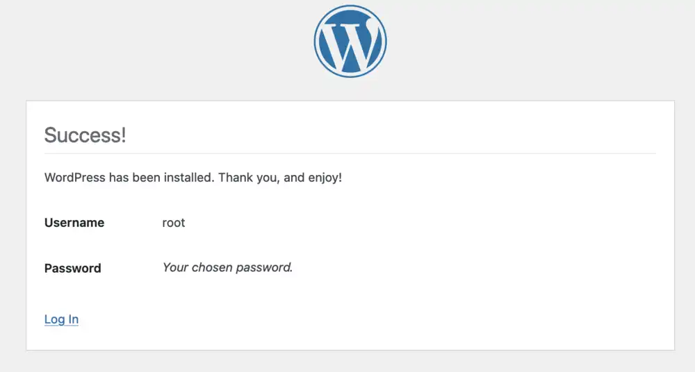

# Kubernetes Workshop

## Index

- [Kubernetes Workshop](#kubernetes-workshop)
  - [Index](#index)
  - [Git clone](#git-clone)
  - [Install kubectl](#install-kubectl)
  - [Download and install Rancher Desktop](#download-and-install-rancher-desktop)
  - [Initialize a new cluster](#initialize-a-new-cluster)
  - [Apply Wordpress Namespace](#apply-wordpress-namespace)
  - [Apply Wordpress Deployment](#apply-wordpress-deployment)
    - [Set nip.io domain](#set-nipio-domain)
      - [./wp/app/app\_ingress.yaml](#wpappapp_ingressyaml)
  - [Visit nip.io domain](#visit-nipio-domain)
  - [Follow Wordpress installation](#follow-wordpress-installation)
    - [Select language](#select-language)
    - [Username and password](#username-and-password)
    - [Success](#success)
    - [Login](#login)
    - [Dashboard](#dashboard)

## Git clone

Clone this repository

```bash
git clone https://github.com/Stenstromen/k8sworkshop
cd k8sworkshop
```

## Install kubectl

Download and install kubectl: [kubernetes.io/docs/tasks/tools/](https://kubernetes.io/docs/tasks/tools/)

## Download and install Rancher Desktop

Download and install Rancher Desktop: [rancherdesktop.io](https://rancherdesktop.io/)

## Initialize a new cluster

Defaults are fine


## Apply Wordpress Namespace

```bash
kubectl apply -f ./wp/namespace
```

## Apply Wordpress Deployment

### Set nip.io domain

Consists of accessible IP address + .nip.io

*`10.0.0.1.nip.io` for example*

#### ./wp/app/app_ingress.yaml

```yaml
...
spec:
  rules:
    - host: # <--- Apply nip.io domain here
...
```

```bash
kubectl apply -f ./wp/app
```

## Visit nip.io domain


... *This is fine*

## Follow Wordpress installation

### Select language


### Username and password


### Success



### Login


### Dashboard


